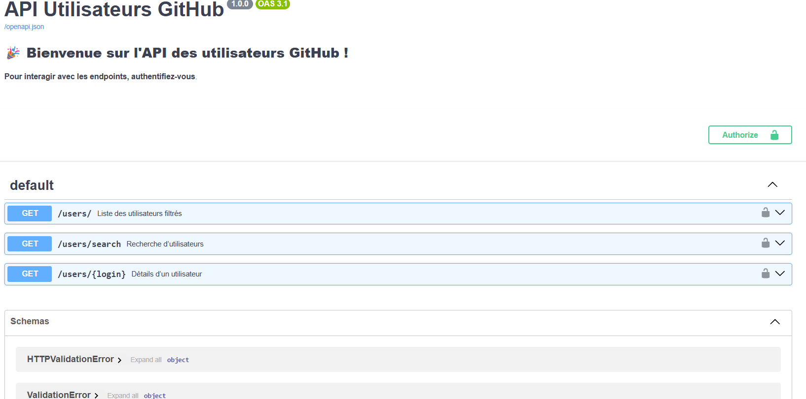

## Présentation

Ce projet propose une API basée sur FastAPI permettant d’extraire, filtrer et exposer des données d’utilisateurs depuis l’API GitHub. Il inclut des scripts d’extraction, de nettoyage, ainsi qu’une interface sécurisée pour accéder aux données filtrées.
Projet réalisé dans le cadre de la formation Simplon.

## Fonctionnalités

- **Extraction** : Récupération des utilisateurs depuis l’API GitHub.
- **Filtrage** : Nettoyage et filtrage des données selon des critères métier.
- **API REST** : Exposition des données via des endpoints sécurisés.


## Structure du projet

 ```
├── extract_users.py               # Script d'extraction depuis l’API GitHub
├── filtered_users.py              # Script de filtrage métier
├── data/
│   ├── users.json                 # Données brutes extraites
│   └── filtered_users.json        # Données nettoyées et filtrées
├── api/
│   ├── main.py                    # Lancement de l’API FastAPI
│   ├── models.py                  # Schémas Pydantic
│   ├── routes.py                  # Endpoints API
│   ├── security.py                # Gestion de l’authentification

├── requirements.txt              # Dépendances du projet
├── .env                          # Exemple de fichier d’environnement
└── README.md                     # Documentation complète du projet
 ```
## Installation

1. Clonez le dépôt :
    ```bash
    git clone <https://github.com/Adjaaaaaaaa/API.git>
    
    ```
2. Installez les dépendances :
    ```bash
    pip install -r requirements.txt
    ```
3. Configurez les variables d’environnement sur `.env`

## Utilisation

- **Extraction des données** :
  ```bash
  python extract_users.py
  ```
- **Filtrage des données** :
  ```bash
  python filtered_users.py
  ```
- **Lancement de l’API** :
  ```bash
  uvicorn api.main:app --reload
  ```
- **l'interface** :
  
  
